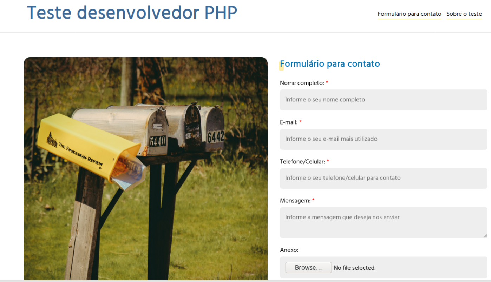
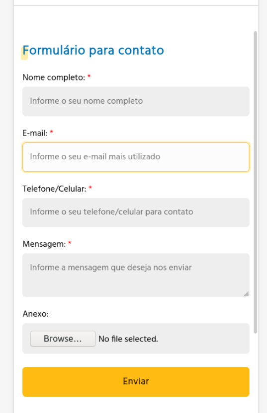
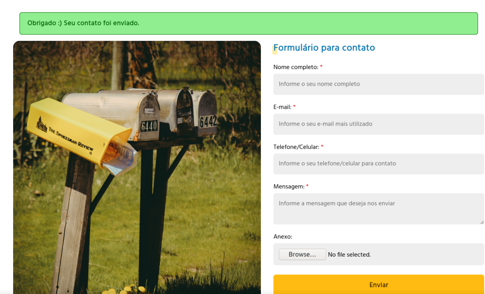
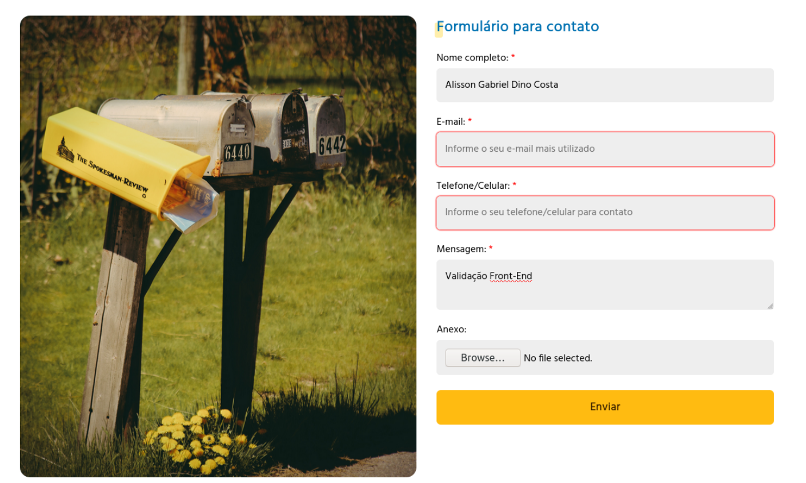
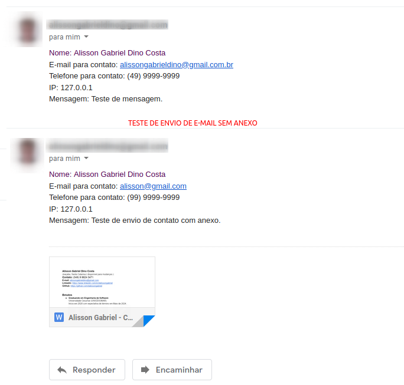

# Aplicação Web para envio de mensagens de contato

Este repositório é focado na criação de uma página de contato.

## Casos de uso

- [x] Usuário deve conseguir enviar uma mensagem (e-mail) com ou sem anexo;

>Mensagem deve conter: nome, email do usuário, telefone do usuário e a mensagem. Anexo é opicional

>Validações necessárias: Email, Telefone, tamanho e tipo de arquivo.

- [x] Os dados enviados deverão ser armazenados em um banco de dados e conter, além das informações exibidas, o ip do remetente e a data e hora do envio;
> O arquivo enviado deve ser armazenado em disco. Apenas o caminho do arquivo deve ser armazenado no banco de dados.
- [x] Uma mensagem deve ser enviada com as informações submetidas no formulário para um e-mail definido em um arquivo de configuração;
- [x] Testes automatizados devem ser escritos para garantir que a página funciona como esperado;


## Screenshots

Abaixo, alguns prints da aplicação em funcionamento e do teste realizado do envio do e-mail.








## Tecnologias utilizadas neste projeto

- HTML, CSS (Flex Box, CSS grid) e Jquery;
- PHP 8;
- SwiftMailer;
- POSTGRES 13;
- PHPUnit;
- Composer;
- Doctrine ORM;
- Git

## Instruções de configuração do projeto

Para rodar o projeto: 

1. Clone o repositório
```
git clone git@github.com:dalissongabriel/contact_php.git
```
2. Na pasta do projeto, execute baixe as dependências do projeto através do composer:
```
composer install
```
3. Crie um banco de dados vazio para ser utilizada pela aplicação: 
```
createdb netshowme_phpteste
```
4. Configure os parâmetros através do arquivo .env.example na raiz do projeto, criando um .env: 
```
cp .env.example .env
```
> Aqui devem ser informados o acesso ao banco de dados, o transport, usuário e senha para envio do e-mail e também, o e-mail que irá receber.
```
SENDER_EMAIL_SMPT_TRANSPORT="INFORME AQUI O TRANSPORT PARA O SMPT" Exemplo: smtp.googlemail.com
SENDER_EMAIL_SMPT_PORT="INFORME AQUI A PORTA SMPT" Exemplo: 465
SENDER_EMAIL_USERNAME="INFORME AQUI O E-MAIL QUE IRÁ ENVIAR A MENSAGEM DE CONTATO" Exemplo: meuemail@netshowme.com
SENDER_EMAIL_PASSWORD="INFORME A SENHA DO USUARIO DE EMAIL" Exemplo: minhasenhasuperseguranota10$$##%%

RECEIVER_EMAIL_ADDRESS="INFORME AQUI O E-MAIL QUE IRÁ RECEBER A MENSAGEM DE CONTATO"

DB_HOST="INFORME AQUI O IP DO BANCO DE DADOS"
DB_USER="INFORME AQUI SEU USUARIO NO BANCO"
DB_PORT="INFORME AQUI A PORTA DO BANCO"
DB_PASS="INFORME AQUI A SENHA DO USUÁRIO"
DB_NAME="INFORME AQUI O NOME DO BANCO DE DADOS"
```
5. Realize o dump e a geração dos proxies na raiz do projeto:

```
composer dump-autoload

php vendor/bin/doctrine orm:generate-proxies
```
6. Rode a migração para preparar o schema do banco de dados: 
```
php vendor/bin/doctrine-migrations migrations:migrate
```
7. (Opcional) Rode os testes para confirmar que tudo está OK:
```
php vendor/bin/phpunit
```
8. Inicie um servidor web na pasta public do projeto: (O jeito mais simples, é usar diretamente o php para tal)
```
php -S localhost:8080 -t public
```
## Técnicas aplicadas


- Apliquei a arquitetura Clean Code no backend, separando as responsabilidades em diferentes camadas e manter o dominio do negócio desaclopado das escolhas de infraestrturas. Isso permite por exemplo, utilizar outro ORM, ou simplesmente usar PDO no projeto, ou ainda, trocar a lib para envio de e-mail sem ser necessário alterar nada na camada de aplicação ou de domínio, tornando manutenções ou evoluções muito práticas.
 
- A seleção de cores e imagens no front-end foram feitas com base em meus atuais conhecimentos sobre acessibildiade, levando em consideração principalmente o contraste e legibilidade;

- O projeto foi desenvolvimento no modelo mobile first, utilizando media queries para garantir a responsividade em telas maiores;

- O repositório foi desenvolvido com commits seguindo a convenção do projeto Angular: https://www.conventionalcommits.org/en/v1.0.0-beta.4/

- Sobre segurança, as validações de tipo e tamanho de anexo foram feitas tanto no front como no backend, para garantir a integridade. 
 
## Contatos:

Esse é meu linkedin para contato :)  https://www.linkedin.com/in/dalissongabriel/


